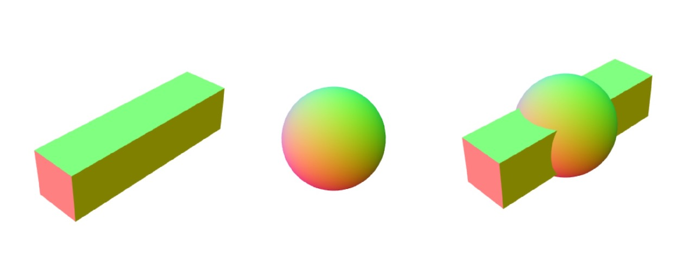

# geom-merge

Merge a list of geometries (simplicial complex) into one geometry and concat all other attributes.



## Installation

```bash
npm install geom-merge
```

## Usage

```js
import merge from "geom-merge";
import { cube, sphere } from "primitive-geometry";

const geometry = merge([cube(), sphere()]);
```

## API

#### `merge(geometries): geometry`

**Parameters**

- geometries: `Array<geometry>` – array of geometry objects

**Returns**

geometry: `{ positions: TypedArray | Array | Array<[x, y, z]>, cells: TypedArray | Array | Array<[a, b, c]>, ...otherAttributesMergedAndFlattened: TypedArray | Array }` - new geometry with cells, and merged/flattened attributes.

Notes:

- Each geometry object requires at least `positions` and `cells`.
- Other array-like attributes like `uvs` or `normals` will be merged and flattened, if available in all geometries.
- If the array-like attributes are a mix of Array and TypedArray, the type of the attribute on the first geometry will be used.
- Cells will be chunked if any of the geometries has chunked cells.
- This module doesn't perform CSG operations

## License

MIT. See [license file](https://github.com/vorg/geom-merge/blob/master/LICENSE.md).
